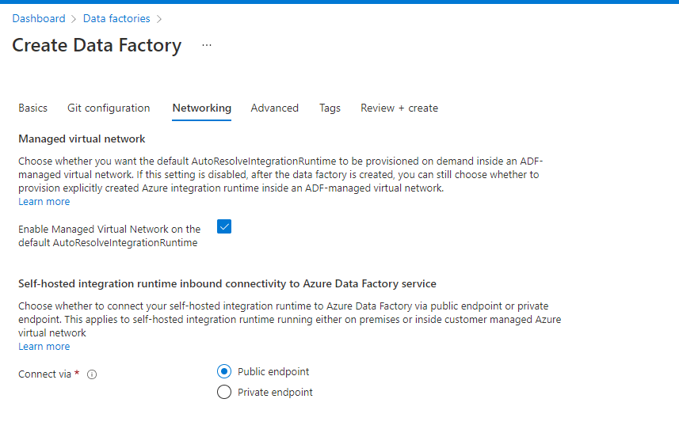
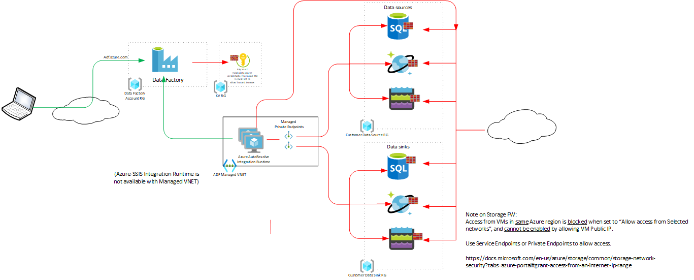
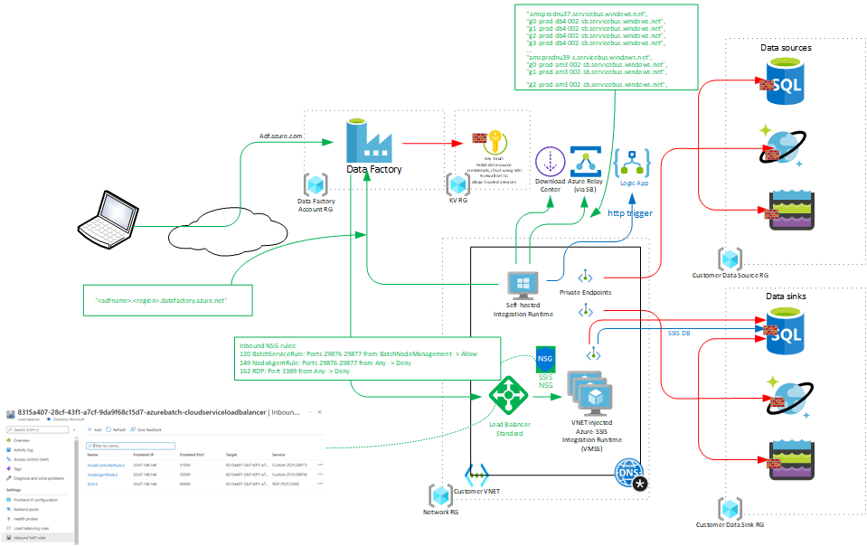
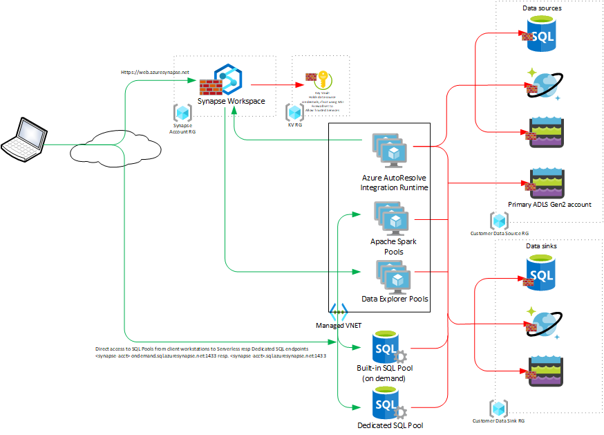
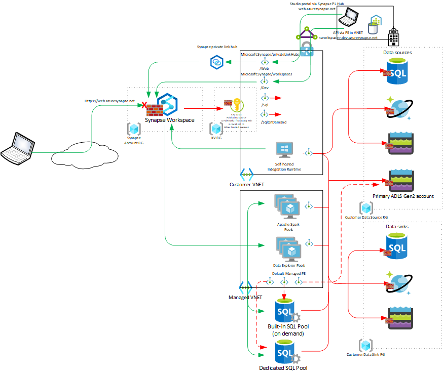

# Networking for Azure Data & Analytics Services - Part 1
Azure features quite a few of services for the manipulation and analysis of data. These services are functionally different and serve different purposes (albeit with some overlap), but there are common themes between them from an infrastructure perspective:
- A multi-tenant control plane, operated through a GUI presented in a web portal.
- A data plane running on customer-dedicated compute
- The data plane processes customer data stored in Azure PaaS, on-premise or in other clouds.

The default network strategy for these services is to use public, internet facing endpoints for both the compute and data planes, with security guaranteed through strong authentication, authorization and encryption. This provides for great ease of use "out-of-the-box", as there are no network boundaries or restrictions to contend with.

However, customers are concerned about the security of their data when public endpoints, foreign compute instances attached to their network and multi-tenant service components are involved. Enterprises often have security policies in place requiring data be accessed through private network endpoints only. Some also restrict public access to service control planes.

In response to customer requirements regarding network access to data and control planes, features and functions have been added to Data & Analytics services over time. These allachieve varying levels of private and restricted access to control and control, but implementations differ between services.

This two-part article aims to summarize networking functionality across Azure Data & Analytics Services in a consistent format. 

This Part 1 addresses [Azure Data Factory (v2)](https://docs.microsoft.com/en-us/azure/data-factory/), [Purview](https://docs.microsoft.com/en-us/azure/purview/) and [Synapse Analytics](https://docs.microsoft.com/en-us/azure/synapse-analytics/). Part 2 will cover HDInsight, Databricks and Azure Machine Learning.

Network diagrams are available in Visio [here](images/Data_AI_network.vsdx).

## Contents
[Azure Data Factory (v2)](#azure-data-factory-v2)
- [Public access](#public-access)     
- [Public access with Managed VNET](#public-access-with-managed-vnet)
- [Public Access with Customer VNET](#public-access-with-customer-vnet)
- [Private Access](#private-access)

[Purview](#purview)
- [Public access](#public-access)
- [Public access with Customer VNET](#public-access-with-customer-vnet)
- [Private access](#private-access)

[Synapse Analytics](#synapse-analytics)
- [Public access](#public-access)
- [Public access with Managed VNET](#public-access-with-managed-vnet)
- [Public access with Managed VNET and Customer VNET](#public-access-with-managed-vnet-and-customer-vnet)
- [Private access](#private-access)

## Azure Data Factory (v2)
Azure Data Factory is an extract-transform-load (ETL), extract-load-transform (ELT) and data integration service. It ingests data from sources within or outside of Azure, applies transformations, and writes to data sinks, again within or outside of Azure. Data stores can be Azure Storage, Data Lake or Azure relational and non-relational data bases, or storage and data base services on-premise or in other clouds.

Azure Data Factory is an Azure resource created in the Azure portal, but it is operated through its own Studio portal.

Data flows are programmed as Pipelines, logical groupings of activities on Datasets. Datasets represent data structures within data stores. Data stores are represented as Linked services, these define the connection information to data stores where Datasets are stored. Linked services can also represent compute resources external to ADF that can host the execution of an Activity. These elements are constructed, controlled and monitored through the Azure Data Factory Studio web portal.

Activities in ADF are executed on Integration Runtimes. These represent the compute capacity that actually does the work, under control of the management plane operated through Azure Data Factory Studio. 

ADF has following types of Integration Runtimes for data movement:
- Azure - Auto Resolve or Regional - Sub-type Public
  - Run data movement and transformation activities between cloud data stores.
  - Dispatch activites to publically networked Azure PaaS such as Azure Databricks, HDInsight, Machine Learning.
  - Default compute instance managed by ADF.
  - Location either Auto Resolve, which means that ADF determines the region [ref Rene Bremer], or pinned to a region at time of creation.
  - Runs in a shared ADF-owned VNET, invisible to the customer.

- Azure - Auto Resolve or Regional - Sub-type Managed Virtual Network
  - Run data movement and transformation activities between cloud data stores.
  - Dispatch activites to publically networked Azure PaaS such as Azure Databricks, HDInsight, Machine Learning.
  - Default compute instance managed by ADF.
  - Location either Auto Resolve, which means that ADF determines the region, or pinned to a region at time of creation.
  - Runs in a Managed VNET, which is a customer-dedicated but ADF-owned VNET.
  - Optionally connects to customer resources through Managed Private Endpoints.

- Self-hosted Integration Runtime
  - Run data movement and transformation activities between cloud- and private data stores.
  - Dispatch activites to on-premise resources and privately networked Azure PaaS.
  - Compute instance managed by the customer.
  - Windows Server VM in a customer-owned VNET in Azure, in another cloud, or a server on-premise.
  - Has the Microsoft Integration Runtime package installed.

ADF has also an Integration Runtime type dedicated to running SSIS (SQL Server Integration Services) packages. SSIS IR is dependant on an SSIS Database (SSISDB), which can run on Azure SQL, SQL Managed Instance or SQL Server either on Azure VM or on-premise. 
The SSIS IR is an ADF-managed compute cluster  supporting following network configurations: 
- Public
  - Runs in a shared ADF-owned VNET, invisible to the customer.
  - Uses public endpoints to access data sources and SSIS DB.

- VNET Join - Standard
  - Injects the cluster VMSS into customer VNET
  - Load Balancer with Inbound NAT rules provides inbound control from Azure Batch to cluster instances
  - SSIS IR can optionally be provided with static Public IPs, or use NAT Gateway for outbound access to data sources and SSIS DB
  - SSIS IR can use Private Endpoints in VNET for outbound access to data sources and SSIS DB

- VNET Join - Express
  - Injects the cluster into customer VNET
- 

Following paragraphs describe the network configurations available with ADF.

:point_right: ***Legend***
Arrows indicate the direction of TCP connections, which is not necessarily the same as the direction of the flow of information. In the context of network infrastructure it is relevant to show "inbound" versus "outbound" at the TCP level. 

- Green - Control and management.
- Red - Customer data.
- Blue - Meta data of customer data.

### Public access
This is the default network configuration.

:point_right:***Properties***
- The Studio web portal at https://adf.azure.com is accessible over the internet.
- Azure and Azure-SSIS Integration Runtime compute instances are managed by ADF.
- Integration Runtimes access data stores over public endpoints.
- Outbound traffic from Integration Runtimes is sourced from a Public IP in the DataFactory.{region} ranges.
- Azure Paas service firewalls on data stores must be set to allow all access. It is not possible to restrict access to ADF managed compute only.
  

### Public access with Managed VNET 
This configuration provides the option to place Azure AutoResolve Integration Runtimes in a Managed VNET. This is a dedicated VNET not shared with other customer's Runtime instances, but it is still controlled by ADF. The VNET is not visible to the customer and cannot be peered or otherwise connected to the customer's network environment. 

When Managed VNET is enabled on ADF, when creating an Azure Integration Runtime you have the ability to select Enable for Virtual Network Configuration.

Managed VNET is not available for SSIS Integration Runtime.

The Managed VNET is dedicated to the customer, and it is possible to deploy Managed Private Endpoints connecting to the customer's data stores into the VNET. 

:exclamation:Managed Private Endpoints are deployed from the ADF Studio portal, not the Azure portal.

Managed Private Endpoints are not directly visible to the customer in the Azure portal. They must be approved in the Azure portal in the Private endpoint connections view on the customer's Paas data store services.

:point_right: ***Properties***
- The Studio web portal at https://adf.azure.com is accessible over the internet.
- Azure Auto Resolve Integration Runtime compute instances are managed by ADF and are deployed in an ADF-managed, customer-dedicated VNET.
- Azure SSIS Integration Runtime cannot be deployed in a Managed VNET.
- Runtimes can access data stores over both Managed Private Endpoints and public endpoints.
- Outbound traffic to public endpoints and internet is sourced from Public IP in the .general AzureCloud.{region} ranges.
- ADF takes care of the Private DNS resolution for the Managed Private Endpoints.
- When using Managed Private Endpoints, Azure Paas service firewalls on data stores can be set to deny public access. 
- When using public endpoints, Paas service firewalls must be set to allow all access. 

A Managed Private Endpoint from the Managed VNET can connect to [Private Link Service](https://docs.microsoft.com/en-us/azure/private-link/private-link-service-overview) in a customer-owned VNET. This facilitates private access to data stores hosted in the customer VNET, or on-premise via ExpressRoute or Site-to-site VPN connections.

### Public Access with Customer VNET
This configuration uses a customer-owned VM in a VNET to execute the Integration Runtime activities. The VM must have the Microsoft Integration Runtime package installed. The Self-Hosted Integration Runtime (SHIR) is defined in the Studio; this returns an authentication key that must be entered when configuring the SHIR.

SHIR connects to the ADF control plane and Studio shows status.

Azure Integration Runtimes, both public and in Managed VNET, can be combined with SHIRs in  customer VNETs in the same ADF instance. 

The control channel of Self-Hosted Integration Runtime requires TLS-secured *outbound* connections *only* , sourced from its Public IP address, to the ADF control plane and to Azure Relay via Service Bus. The set of fqdn's that SHIR needs to reach is listed by clicking View Service URLs.

SQL Server Integration Services Runtime injected into the customer VNET requires *inbound* connectivity. Connectivity is secured through a Load Balancer with inbound NAT rules and a Network Security Group, inserted and configured by ADF.

:point_right: ***Properties***
- The Studio web portal at https://adf.azure.com is accessible over the internet.
- Self Hosted Integration Runtime application runs on customer VMs in a customer VNET
- Azure SSIS Integration Runtime can be injected in a customer VNET.
- Runtimes can access data stores over both Private Endpoints and public endpoints.
- Customer must manage DNS resolution for Private Endpoints, either through Private DNS Zones or custom DNS.
- When using Private Endpoints, Azure Paas service firewalls on data stores can be set to deny public access. 
- When using public endpoints, Paas service firewalls must be set to allow all access.

### Private Access
This configuration enables private access from the Self-Hosted Integration Runtime to the ADF control plane, and to ADF Studio via Private Endpoints inserted in the customer VNET. Private access from SHIR to the ADF control plane is through a Private Endpoint to the Datafactory sub-resource of the ADF instance; private access to the Studio is through a Private Endpoint to the Portal sub-resources. These Private Endpoints are created in the Azure portal, on the Settings - Networking page, Private endpoint connections tab.

Setting Network access to Private endpoint on the Settings - Networking page ensures that a Self-Hosted Integration Runtime can *only* connect to the ADF control plane via the PE to the Datafactory sub-resource. This does *not* close public access to the Studio portal; the Studio will be accessible through both the internet and the Private Endpoint to the Portal sub-resource.

:point_right: ***Properties***
- Private Endpoints to the ADF control plane and the Studio are injected in the customer VNET.
- The Studio web portal at https://adf.azure.com is accessible over the internet and the Portal Private Endpoint.
- When Network access is set to Private endpoint, a Self Hosted Integration Runtime can *only* access the control plane via the Datafactory Private Endpoint. The Studio web portal at https://adf.azure.com remains accessible over both the internet and the Portal Private Endpoint.
- Azure SSIS Integration Runtime can be injected in a customer VNET.
- Runtimes can access data stores over both Private Endpoints and public endpoints.
- Customer must manage DNS resolution for Private Endpoints, either through Private DNS Zones or custom DNS.
- When using Private Endpoints, Azure Paas service firewalls on data stores can be set to deny public access. 
- When using public endpoints, Paas service firewalls must be set to allow all access.

:exclamation:Full functionality of Self-Hosted Integration Runtime requires outbound access to Azure Relay via Service Bus. 

The Service Bus fqdn's required are not available via the Private Endpoint to the Datafactory sub-resource, and public outbound access to these fqdn's must be allowed. This set of fqdn's is available through the View Service URLs button, on the Nodes tab on the Integration Runtime status page in Studio. 

When access to these fqdn's is blocked, interactive authoring functionality via Studio on this Integration Runtime is not available and its status will be Running (Limited):
*Cloud service cannot connect to the integration runtime through service bus. You may not be able to use the Copy Wizard to create data pipelines for copying data from/to on-premises data stores.

To resolve this, ensure there is no connectivity issues with Azure Relay. This requires enabling outbound communication to <>.servicebus.windows.net on Port 443; either directly through this Integration Runtime or by using a Proxy Server.
See Ports and security considerations and Proxy server considerations in the Integration runtime article for details.
As a work-around in case Azure Relay connectivity cannot be established, code (or) Azure PowerShell to construct the pipelines (no UI authoring).*

:exclamation:Self-Hosted Integration Runtime requires public outbound access via to download.microsoft.com for updates of Windows Server.

## Purview
Azure Purview is data governance service that helps customers manage their data estates across  Azure and other clouds and on-premise.  Purview automates data discovery by providing data scanning and classification as a service for assets across the data estate. Metadata and descriptions of discovered data assets are integrated into a holistic map of the data estate. Atop this map, there are purpose-built apps that create environments for data discovery, access management, and insights about your data landscape.

Where Azure Data Factory is aimed at moving and transforming data, Purview works to catalog and map data. 

Similar to ADF, Purview is an Azure resource created in the Azure portal, but operated through its own Studio portal. 

As in ADF, activities in Purview are executed on Integration Runtimes. These represent the compute capacity that actually does the work, under control of the management plane operated through Purview Studio. Purview has following types of Integration Runtimes:
- Azure - Auto Resolve - Public
  - Run data data discovery on Azure data stores.
  - Default compute instance managed by Purview.
  - Location is Auto Resolve, which means that Purview determines the region.
  - Runs in a shared Purview-owned VNET, invisible to the customer.
  - Is always present, but *not* shown in the Integration Runtimes view under Data Map in the Purview Studio (in contast to ADF, which does show )
  - 
- Azure - Auto Resolve or Regional - Managed VNET

  - Optionally installed in a Managed VNET, which is a customer-dedicated but Purview-owned VNET.
    - When in a Managed VNET
- Location is either Auto Resolve, which means that Purview determines the best region [ref Rene Bremer], or pinned to a region at time of creation.

- Self-hosted Integration Runtime
  - Run data movement and transformation activities between cloud- and private data stores.
  - Dispatch activites to on-premise resources and privately networked Azure PaaS.
  - Compute instance managed by the customer.
  - Windows Server VM in a customer-owned VNET in Azure, in another cloud, or a server on-premise.
  - Has the Microsoft Integration Runtime package installed.

### Public access
This is the default network configuration.

### Public access with Customer VNET

### Private access

## Synapse Analytics

### Public access
This is the default network configuration.

### Public access with Managed VNET 

Managed VNET

Managed VNET + Managed PE

### Public access with Managed VNET and Customer VNET

### Private access

