# Networking for Azure Data & Analytics Services - Part 1
Azure features a number of services for manipulation and analysis of data. These services are functionally different and serve different purposes (although some overlap exists), but there are common themes between them from an infrastructure perspective:
- A multi-tenant control plane, operated through a GUI presented in a web portal.
- A data plane running on customer-dedicated compute
- The data plane processes customer data stored in Azure PaaS, on-premise or in other clouds.

The default network strategy for these services is to use public, internet facing endpoints for both the compute and data planes, with security guaranteed through strong authentication, authorization and encryption. This provides for great ease of use "out-of-the-box", as there are no network boundaries or restrictions to contend with.

However, customers are concerned about the security of their data when public endpoints, foreign compute instances attached to their network and multi-tenant service components are involved. Enterprise security policies often require data to be accessed through private network endpoints only. Some enterprise customers also restrict public access to service control planes.

In response to customer requirements and concerns over network access to data and control planes, features and functions have been added to Data & Analytics services over time. These achieve varying levels of private and restricted access to data and control, but implementations differ between services.

This two-part article aims to summarize networking functionality across Azure Data & Analytics Services in a consistent format. It is not intended to replace service documentation published on docs.microsoft.com. In case of differences between this article and service documentation, the latter prevails and should be used for reference. 

This Part 1 addresses [Azure Data Factory (v2)](https://docs.microsoft.com/en-us/azure/data-factory/), [Purview](https://docs.microsoft.com/en-us/azure/purview/) and [Synapse Analytics](https://docs.microsoft.com/en-us/azure/synapse-analytics/). Part 2 will cover HDInsight, Databricks and Azure Machine Learning.

Network diagrams are available in Visio [here](images/Data_AI_network.vsdx).

## Contents
[Azure Data Factory (v2)](#azure-data-factory-v2)
- [ADFv2 - Public access](#adfv2-public-access)
- [ADFv2 - Public access with Managed VNET](#adfv2---public-access-with-managed-vnet)
- [ADFv2 - Public access with customer VNET](#adfv2---public-access-with-customer-vnet)
- [ADFv2 - Private access](#adfv2---private-access)

[Purview](#purview)
- [Purview - Public access](#purview-public-access)
- [Purview - Public access with Managed VNET](#purview-public-access-with-managed-vnet)
- [Purview - Public access with Customer VNET](#purview-public-access-with-customer-vnet)
- [Purview - Private access](#purview-private-access)

[Synapse Analytics](#synapse-analytics)
- [Synapse - Public access](#synapse-public-access)
- [Synapse - Public access with Managed VNET](#synapse-public-access-with-managed-vnet)
- [Synapse - Public access with Managed VNET and Customer VNET](#synapse-public-access-with-managed-vnet-and-customer-vnet)
- [Synapse - Private access](#synapse-private-access)

## Legend
In the network diagrams below, arrows indicate the direction of TCP connections. This is not necessarily the same as the direction of flow of information. In the context of network infrastructure it is relevant to show "inbound" versus "outbound" at the TCP level. 

Color coding of flows:
- Green - Control and management.
- Red - Customer data.
- Blue - Meta data of customer data.

## Azure Data Factory (v2)
Azure Data Factory is an extract-transform-load (ETL), extract-load-transform (ELT) and data integration service. It ingests data from sources within or outside of Azure, applies transformations, and writes to data sinks, again within or outside of Azure. Data stores can be Azure Storage, Data Lake or Azure relational and non-relational data bases, or storage and data base services on-premise or in other clouds.

Azure Data Factory is an Azure resource created in the Azure portal, but it is operated through its own Studio portal.

Data flows are programmed as Pipelines, logical groupings of activities on Datasets. Datasets represent data structures within data stores. Data stores are represented as Linked services, these define the connection information to data stores where Datasets are stored. Linked services can also represent compute resources external to ADF that can host the execution of an Activity. These elements are constructed, controlled and monitored through the Azure Data Factory Studio web portal.

Activities in ADF are executed on Integration Runtimes. These represent the compute capacity that actually does the work, under control of the management plane operated through Azure Data Factory Studio. 

#### Runtimes - Data Movement

ADF has following types of Integration Runtimes for data movement:
- ##### Azure - Auto Resolve or Regional - Sub-type Public
  - Run data movement and transformation activities between cloud data stores.
  - Dispatch activites to publically networked Azure PaaS such as Azure Databricks, HDInsight, Machine Learning.
  - Default compute instance managed by ADF.
  - Location either Auto Resolve, which means that ADF determines the region [ref Rene Bremer], or pinned to a region at time of creation.
  - Runs in a shared ADF-owned VNET, invisible to the customer.

- ##### Azure - Auto Resolve or Regional - Sub-type Managed Virtual Network
  - Run data movement and transformation activities between cloud data stores.
  - Dispatch activites to publically networked Azure PaaS such as Azure Databricks, HDInsight, Machine Learning.
  - Default compute instance managed by ADF.
  - Location either Auto Resolve, which means that ADF determines the region, or pinned to a region at time of creation.
  - Runs in a Managed VNET, which is a customer-dedicated but ADF-owned VNET.
  - Optionally connects to customer resources through Managed Private Endpoints.

- ##### Self-hosted Integration Runtime
  - Run data movement and transformation activities between cloud- and private data stores.
  - Dispatch activites to on-premise resources and privately networked Azure PaaS.
  - Compute instance managed by the customer.
  - Windows Server VM in a customer-owned VNET in Azure, in another cloud, or a server on-premise.
  - Has the Microsoft Integration Runtime package installed.

#### Runtimes - SSIS

ADF has a separte Integration Runtime type dedicated to running SSIS (SQL Server Integration Services) packages. 

[SQL Server Integration Services](https://docs.microsoft.com/en-us/sql/integration-services/sql-server-integration-services?view=sql-server-ver15) is a platform for building enterprise-level data integration and data transformations solutions. Use Integration Services to solve complex business problems by copying or downloading files, loading data warehouses, cleansing and mining data, and managing SQL Server objects and data.

SSIS IR is dependant on an SSIS Database (SSISDB), which can run on Azure SQL, SQL Managed Instance or SQL Server either on Azure VM or on-premise. 
The SSIS IR is an ADF-managed compute cluster supporting following network configurations: 
- ##### Public
  - Runs in a shared ADF-owned VNET, invisible to the customer.
  - Uses public endpoints to access data sources and SSIS DB.
- ##### Standard VNET Injection
  - *Injects* SSIS IR cluster Virtual Machine Scale Set into the customer VNET, instance NICs show as Connected devices in the VNET.
  - Deploys Load Balancer with Inbound NAT rules, to provide *inbound* control from Azure Batch to cluster instances.
  - Attaches a Network Security Group to the Network Interfaces of the IR instances allowing inbound to ports 29876-29877 from BatchNodeManagement.
  - Requires outbound public access on ports 80, 443 and 445 to service tag AzureCloud for access to dependencies (Blob and File Storage, Azure Container Registry, Event Hub).
  - SSIS IR can optionally be provided with static Public IPs, or use NAT Gateway for outbound access to data sources and SSIS DB.
  - SSIS IR can optionally use Private Endpoints in VNET for outbound access to data sources and SSIS DB.
  - Documentation: [Standard virtual network injection method](https://docs.microsoft.com/en-us/azure/data-factory/azure-ssis-integration-runtime-standard-virtual-network-injection)
- ##### Express VNET Injection (Preview)
  - SSIS IR instances run as containers on pre-provisioned VMs in an ADF-owned VNET.
  - Containers are switched into the customer's VNET using [SWIFT](https://microsoft.sharepoint.com/teams/swiftdashboard9) (fast VNET switching) when the customer submits an SSIS IR Express provisioning request in Studio.
  - Express VNET injection provisioning is faster than Standard (5 vs 30 minutes), but prerequisites and restrictions apply, see documentation: [Express virtual network injection method (Preview)](https://docs.microsoft.com/en-us/azure/data-factory/azure-ssis-integration-runtime-express-virtual-network-injection)
 
SSIS IR is only available for deployment in Azure, there is no self-hosted version.

### ADFv2 Public access
This is the default network configuration.

:point_right:***Properties***
- The Studio web portal at https://adf.azure.com is accessible over the internet.
- Azure and Azure-SSIS Integration Runtime compute instances are managed by ADF.
- Integration Runtimes access data stores over public endpoints.
- Outbound traffic from Integration Runtimes is sourced from a Public IP in the DataFactory.{region} ranges.
:exclamation:Connections to Storage accounts in the same region as the Integration Runtime originate from internal Azure data center addresses. 
- Azure Paas service firewalls on data stores can be may be used to restrict network access, but the exception "Allow Azure services on the trusted services list to access this storage account."
must be enabled. This allows ADF to access the data stores, as described in [Trusted access based on a managed identity](https://docs.microsoft.com/en-us/azure/storage/common/storage-network-security?tabs=azure-portal#trusted-access-based-on-a-managed-identity).
- It is not possible to restrict access to ADF managed runtimes belonging to a specific ADF account. Use Managed VNET with Managed Private Endpoints or a Self-Hosted Integration Runtime is network-level access restriction to a specific runtime instance is required. 
  

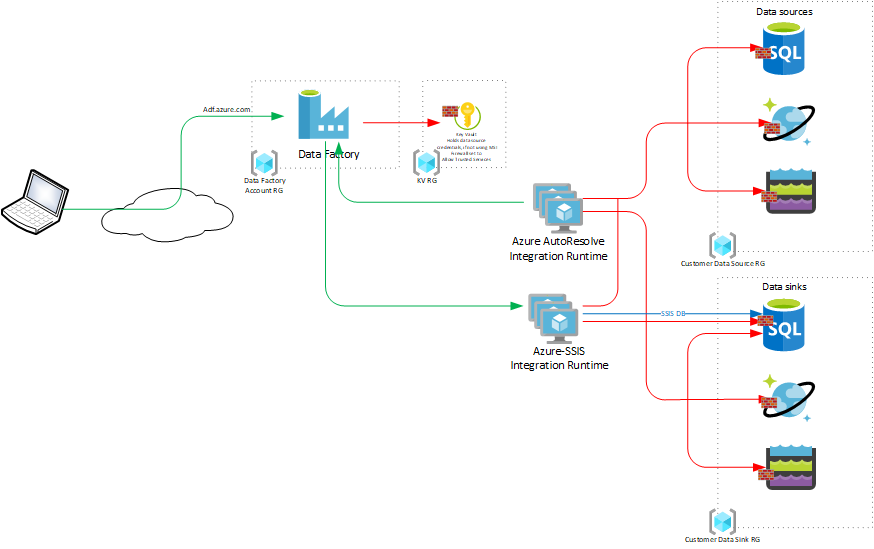

### ADFv2 Public access with Managed VNET 
This configuration provides the option to place Azure AutoResolve Integration Runtimes in a Managed VNET. This is a dedicated VNET not shared with other customer's Runtime instances, but it is still controlled by ADF. The VNET is not visible to the customer and cannot be peered or otherwise connected to the customer's network environment. 

When Managed VNET is enabled on ADF, when creating an Azure Integration Runtime you have the ability to select Enable for Virtual Network Configuration.

Managed VNET is not available for SSIS Integration Runtime.

The Managed VNET is dedicated to the customer, and it is possible to deploy Managed Private Endpoints connecting to the customer's data stores into the VNET. 

:exclamation:Managed Private Endpoints are deployed from the ADF Studio portal, not the Azure portal.

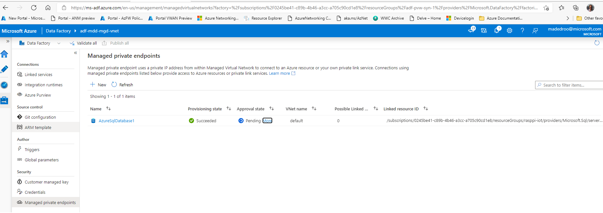

Managed Private Endpoints are not directly visible to the customer in the Azure portal. They must be approved in the Azure portal in the Private endpoint connections view on the customer's Paas data store services.

:point_right: ***Properties***
- The Studio web portal at https://adf.azure.com is accessible over the internet.
- Azure Auto Resolve Integration Runtime compute instances are managed by ADF and are deployed in an ADF-managed, customer-dedicated VNET.
- Azure SSIS Integration Runtime cannot be deployed in a Managed VNET.
- Runtimes can access data stores over both Managed Private Endpoints and public endpoints.
- Outbound traffic to public endpoints and internet is sourced from a Public IP in the general AzureCloud.{region} ranges.
- ADF takes care of the Private DNS resolution for the Managed Private Endpoints.
- When using Managed Private Endpoints, Azure Paas service firewalls on data stores can be set to deny public access. 
- When not using Managed Private Endpoints, Azure Paas service firewalls on data stores can be may be used to restrict network access, but the exception "Allow Azure services on the trusted services list to access this storage account." must be enabled. This allows ADF to access the data stores, as described in [Trusted access based on a managed identity](https://docs.microsoft.com/en-us/azure/storage/common/storage-network-security?tabs=azure-portal#trusted-access-based-on-a-managed-identity).

A Managed Private Endpoint from the Managed VNET can connect to [Private Link Service](https://docs.microsoft.com/en-us/azure/private-link/private-link-service-overview) in a customer-owned VNET. This facilitates private access to data stores hosted in the customer VNET, or on-premise via ExpressRoute or Site-to-site VPN connections.

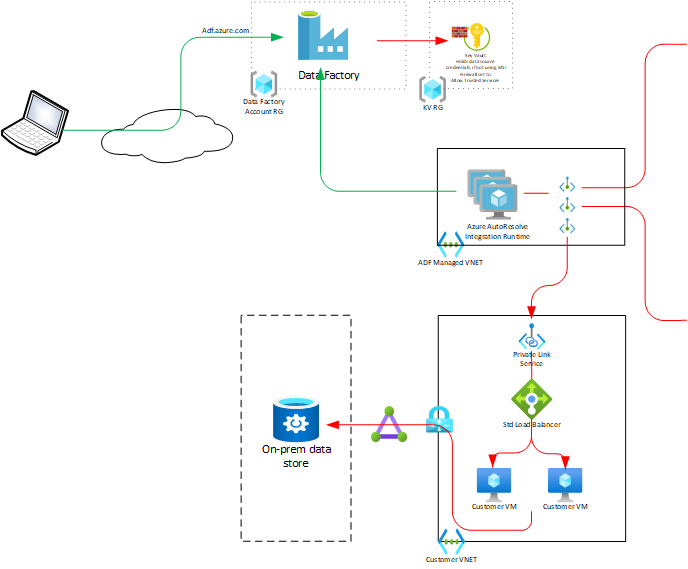

### ADFv2 Public Access with Customer VNET
This configuration uses a customer-owned VM in a VNET to execute the Integration Runtime activities. The VM must have the Microsoft Integration Runtime package installed. The Self-Hosted Integration Runtime (SHIR) is defined in the Studio; this returns an authentication key that must be entered when configuring the SHIR.

SHIR connects to the ADF control plane and Studio shows status.

Azure Integration Runtimes, both public and in Managed VNET, can be combined with SHIRs in  customer VNETs in the same ADF instance. 

The control channel of Self-Hosted Integration Runtime requires TLS-secured *outbound* connections *only* , sourced from its Public IP address, to the ADF control plane and to Azure Relay via Service Bus. The set of fqdn's that SHIR needs to reach is listed by clicking View Service URLs.

SQL Server Integration Services Runtime injected into the customer VNET requires *inbound* connectivity. Connectivity is secured through a Load Balancer with inbound NAT rules and a Network Security Group, inserted and configured by ADF.

:point_right: ***Properties***
- The Studio web portal at https://adf.azure.com is accessible over the internet.
- Self Hosted Integration Runtime application runs on customer VMs in a customer VNET
- Azure SSIS Integration Runtime can be injected in a customer VNET.
- Runtimes can access data stores over both Private Endpoints and public endpoints.
- Customer must manage DNS resolution for Private Endpoints, either through Private DNS Zones or custom DNS.
- When using Private Endpoints, Azure Paas service firewalls on data stores can be set to deny public access. 
- When using public endpoints, Paas service firewalls must be set to allow all access.

### ADFv2 Private Access
This configuration enables private access from the Self-Hosted Integration Runtime to the ADF control plane, and to ADF Studio via Private Endpoints inserted in the customer VNET. Private access from SHIR to the ADF control plane is through a Private Endpoint to the Datafactory sub-resource of the ADF instance; private access to the Studio is through a Private Endpoint to the Portal sub-resources. These Private Endpoints are created in the Azure portal, on the Settings - Networking page, Private endpoint connections tab.

Setting Network access to Private endpoint on the Settings - Networking page ensures that a Self-Hosted Integration Runtime can *only* connect to the ADF control plane via the PE to the Datafactory sub-resource. This does *not* close public access to the Studio portal; the Studio will be accessible through both the internet and the Private Endpoint to the Portal sub-resource.

:point_right: ***Properties***
- Private Endpoints to the ADF control plane and the Studio are injected in the customer VNET.
- The Studio web portal at https://adf.azure.com is accessible over the internet and the Portal Private Endpoint.
- When Network access is set to Private endpoint, a Self Hosted Integration Runtime can *only* access the control plane via the Datafactory Private Endpoint. The Studio web portal at https://adf.azure.com remains accessible over both the internet and the Portal Private Endpoint.
- Azure SSIS Integration Runtime can be injected in a customer VNET.
- Runtimes can access data stores over both Private Endpoints and public endpoints.
- Customer must manage DNS resolution for Private Endpoints, either through Private DNS Zones or custom DNS.
- When using Private Endpoints, Azure Paas service firewalls on data stores can be set to deny public access. 
- When using public endpoints, Paas service firewalls must be set to allow all access.

:exclamation:Full functionality of Self-Hosted Integration Runtime requires outbound access to Azure Relay via Service Bus. 

The Service Bus fqdn's required are not available via the Private Endpoint to the Datafactory sub-resource, and public outbound access to these fqdn's must be allowed. This set of fqdn's is available through the View Service URLs button, on the Nodes tab on the Integration Runtime status page in Studio. 

When access to these fqdn's is blocked, interactive authoring functionality via Studio on this Integration Runtime is not available and its status will be Running (Limited):

***Cloud service cannot connect to the integration runtime through service bus. You may not be able to use the Copy Wizard to create data pipelines for copying data from/to on-premises data stores.
To resolve this, ensure there is no connectivity issues with Azure Relay. This requires enabling outbound communication to `<>.servicebus.windows.net on Port 443`, either directly or by using a Proxy Server.
See [Ports and firewalls](https://docs.microsoft.com/en-us/azure/data-factory/create-self-hosted-integration-runtime?tabs=data-factory#ports-and-firewalls) in the Integration runtime article for details.
As a work-around in case Azure Relay connectivity cannot be established, code (or) Azure PowerShell to construct the pipelines (no UI authoring).***

:exclamation:Self-Hosted Integration Runtime requires public outbound access via to download.microsoft.com for updates of Windows Server.

## Purview
Azure Purview is data governance service that helps customers manage their data estates across Azure and other clouds and on-premise.  Purview automates data discovery by providing data scanning and classification as a service for assets across the data estate. Metadata and descriptions of discovered data assets are integrated into a holistic map of the data estate. This map is the basis for data discovery, access management, and insights about the data landscape.

Similar to ADF, Purview is an Azure resource created in the Azure portal, but is operated through its own Studio portal. 

Where Azure Data Factory is aimed at moving and transforming data, Purview works to catalog and map data. It scans customer's data sources to capture technical metadata like names, file size, columns etc. It also captures schema for structured data sources. This information is ingested and processed to produce Data Maps, Catalogs and Insights. 

A Purview account relies on a managed Storage account and a managed Event Hubs namespace for ingestion of scanned metadata. These are created with the Purview account and are located in a separate resource group named {pruviewaccountname}-managed.

As in ADF, activities in Purview are executed on Integration Runtimes. These represent the compute capacity that actually does the work, under control of the management plane operated through Purview Studio.
Purview has following types of Integration Runtimes:
- Azure - Auto Resolve - Public
  - Run data data discovery on Azure data stores.
  - Default compute instance managed by Purview.
  - Location is Auto Resolve, which means that Purview determines the region.
  - Runs in a shared Purview-owned VNET, invisible to the customer.
  - Is always present, but *not* shown in the Integration Runtimes view under Data Map in the Purview Studio (in contrast to ADF, which does always show the Public Integration Runtime).
   
- Azure - Auto Resolve or Regional - Managed VNET

  - Optionally installed in a Managed VNET, which is a customer-dedicated but Purview-owned VNET.
  - Location is either Auto Resolve, which means that Purview determines the best region [ref Rene Bremer], or pinned to a region at time of creation.

- Self-hosted Integration Runtime
  - Run data movement and transformation activities between cloud- and private data stores.
  - Dispatch activites to on-premise resources and privately networked Azure PaaS.
  - Compute instance managed by the customer.
  - Windows Server VM in a customer-owned VNET in Azure, in another cloud, or a server on-premise.
  - Has the Microsoft Integration Runtime package installed.

Integration runtimes must have network access to the managed Storage account and Event Hubs namespace used for ingestion, through either public or private endpoints.

### Purview Public access
This is the default network configuration.

:point_right:***Properties***
- The Studio web portal at https://web.purview.azure.com/ is accessible over the internet.
- Azure AutoResolve Public Integration Runtime is deployed in a shared VNET managed by Purview.  
:exclamation:The default Public Azure Integration Runtime is always present but does *not* show in the Integration runtimes view in Purview Studio (Data Map -> Integration runtimes) 
- Integration Runtimes access customer data stores and managed resources for ingestion over public endpoints.
- Outbound traffic from Integration Runtimes is sourced from a Public IP in the DataFactory.{region} ranges.
:exclamation:Connections to Storage accounts in the same region as the Integration Runtime originate from internal Azure data center addresses.
- Azure Paas service firewalls on data stores may be used to restrict network access, but the exception "Allow Azure services on the trusted services list to access this storage account."
must be enabled. This allows ADF to access the data stores, as described in [Trusted access based on a managed identity](https://docs.microsoft.com/en-us/azure/storage/common/storage-network-security?tabs=azure-portal#trusted-access-based-on-a-managed-identity).
- It is not possible to restrict access to Purview managed runtimes belonging to a specific Purview account. Use Managed VNET with Managed Private Endpoints or a Self-Hosted Integration Runtime if network-level access restriction to a specific runtime instance is required.

### Purview Public access with Managed VNET
Similar to ADFv2, Purview has the ability to install the Azure Integration Runtime in a Managed VNET. This is a dedicated VNET not shared with other customer's Runtime instances, but it is still controlled by Purview. The VNET is not visible to the customer and cannot be peered or otherwise connected to the customer's network environment. Contrary to ADFv2, there is no option to enable Managed VNET at the account level in Azure Portal. Managed VNET is the default / only selection available when creating additional Azure Runtimes in Purview Studio. A Public type Integration Runtime is always present (but not shown in Studio), any additional Runtimes will be of type Managed VNET.

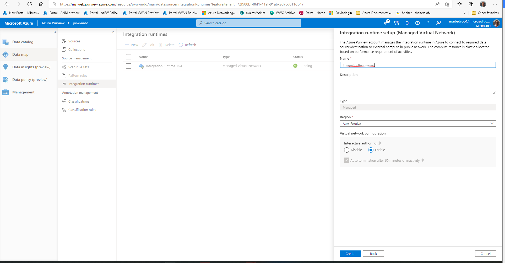

Creating an Integration Runtime in a Managed VNET automatically provisions Managed Private Endpoints for the Purview Account and managed Storage account. These need to be approved in the Azure portal. It is also possible to deploy Managed Private Endpoints to the customer's data sources in the Managed VNET.

:point_right: ***Properties***
- The Studio web portal at https://web.purview.azure.com is accessible over the internet.
- Azure AutoResolve or Regional Integration Runtime compute instances are managed by Purview and are deployed in an Purview-managed, customer-dedicated VNET.
- Runtimes can access data stores over both Managed Private Endpoints and public endpoints.
- Ingestion is over Managed Private Endpoints.
- Outbound traffic to public endpoints and internet is sourced from a Public IP in the general AzureCloud.{region} ranges.
:exclamation:Connections to Storage accounts in the same region as the Integration Runtime originate from internal Azure data center addresses.
- Purview takes care of the Private DNS resolution for the Managed Private Endpoints.
- When using Managed Private Endpoints, Azure Paas service firewalls on data stores can be set to deny public access. 
- When not using Managed Private Endpoints, Azure Paas service firewalls on data stores may be used to restrict network access, but the exception "Allow Azure services on the trusted services list to access this storage account." must be enabled. This allows ADF to access the data stores, as described in [Trusted access based on a managed identity](https://docs.microsoft.com/en-us/azure/storage/common/storage-network-security?tabs=azure-portal#trusted-access-based-on-a-managed-identity).

### Purview Public access with Customer VNET
This configuration uses a customer-owned VM in a VNET to execute the Integration Runtime activities. The Microsoft Integration Runtime package that must be installed on the VM is the same as for ADFv2. The Self-Hosted Integration Runtime (SHIR) is defined in the Studio. 

Defining a SHIR in Studio returns an authentication key that must be entered in Microsoft Integration Runtime Configuration Manager on the SHIR VM.

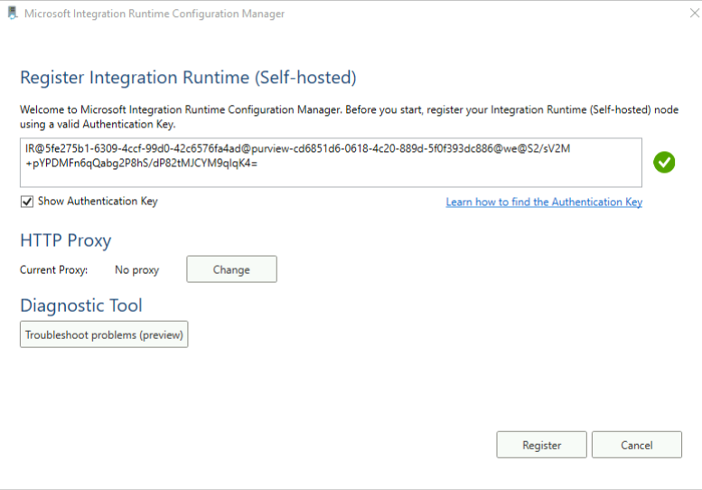

Azure Integration Runtimes, both public and in Managed VNET, can be combined with SHIRs in customer VNETs in the same Purview account.

The control channel of Self-Hosted Integration Runtime requires TLS-secured *outbound* connections *only*, sourced from its Public IP address, to the Purview control plane and to Azure Relay via Service Bus.

Ingestion can be over public endpoints or over Private Endpoints. The ingestion private endpoint connection is created from the Purview account page in the Azure portal, under Networking.

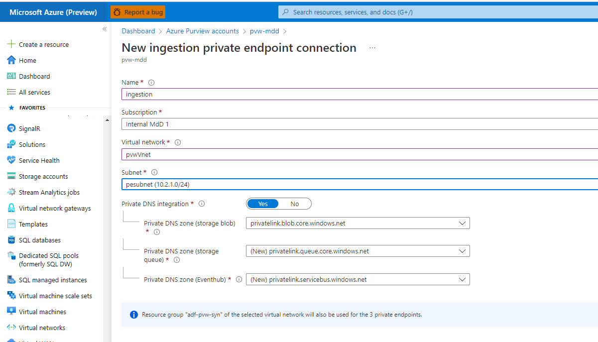

:point_right: ***Properties***
- The Studio web portal at https://web.purview.azure.com is accessible over the internet.
- Self Hosted Integration Runtime application runs on customer VMs in a customer VNET.
- SHIRs can access customer data stores over both Private Endpoints injected in the customer VNET and public endpoints.
- SHIRs can access the ingestion resources over both Ingestion Private Endpoints injected in the VNET and public endpoints.
- Outbound traffic to public endpoints and internet is sourced from the from the SHIR VM's Public IP.
- Customer must manage DNS resolution for Private Endpoints, either through Private DNS Zones or custom DNS.
- When using Private Endpoints, Azure Paas service firewalls on data stores can be set to deny public access. 
- When using public endpoints, Paas service firewalls must be set to allow access from the SHIR's public IP address.
:exclamation:Connections to Storage accounts in the same region as the Integration Runtime originate from internal Azure data center addresses, and cannot be filtered by the Storage account firewall.

### Purview Private access
This configuration sets Public network access to Deny on the Purview account.

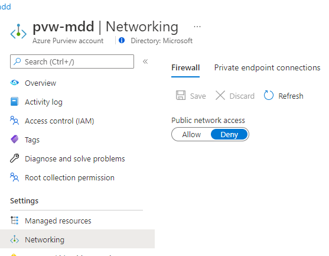

This enables private-only client access to the Studio portal, through a Private Endpoint connection to the Portal and Account sub-resources of the Purview account. Studio access from on-premise can be achieved through VPN or ExpreesRoute connections to the VNET where the PE's to the Portal and Account are located.
Private access from SHIR to the Purview control plane is through a Private Endpoint to the Account sub-resource. These Private Endpoints are created in the Azure portal under the Purview account, on the Settings - Networking page, Private endpoint connections tab.

Ingestion is through the Ingestion Private Endpoint Connection, which consists of Private Endpoints to blob- and queue storage in the managed Storage account, and to the managed Event Hub namespace.

:point_right: ***Properties***
- The Studio web portal at https://web.purview.azure.com is only accessible via Private Endpoints.
- Self Hosted Integration Runtime application runs on customer VMs in a customer VNET. A Private Endpoint to the Account subresource must be accessible, either in the same or in a peered VNET.
- Outbound internet access from SHIR is not needed for Purview to operate, but is optional to:
  - Download Center for Windows and application updates.
  - Azure Relay (via Service Bus) for interactive authoring and connection test functions.
- SHIRs can access customer data stores over both Private Endpoints injected in the customer VNET, and over public endpoints.
- SHIRs can access the ingestion resources over both Ingestion Private Endpoints injected in the VNET and over public endpoints.
- Outbound traffic to public endpoints and internet is sourced from the from the SHIR VM's Public IP.
- Customer must manage DNS resolution for Private Endpoints, either through Private DNS Zones or custom DNS.
- When using Private Endpoints, Azure Paas service firewalls on data stores can be set to deny public access. 
- When using public endpoints, Paas service firewalls must be set to allow access from the SHIR's public IP address.
:exclamation:Connections to Storage accounts in the same region as the Integration Runtime originate from internal Azure data center addresses, and cannot be filtered by the Storage account firewall.

When the customer has data sources in multiple regions, it is recommended to deploy SHIRs in each region. This minimizes  network latency for data flows between sources and SHIRs, optimizing scan performance. Only metadata resulting from scans are sent cross-region to central ingestion resources.

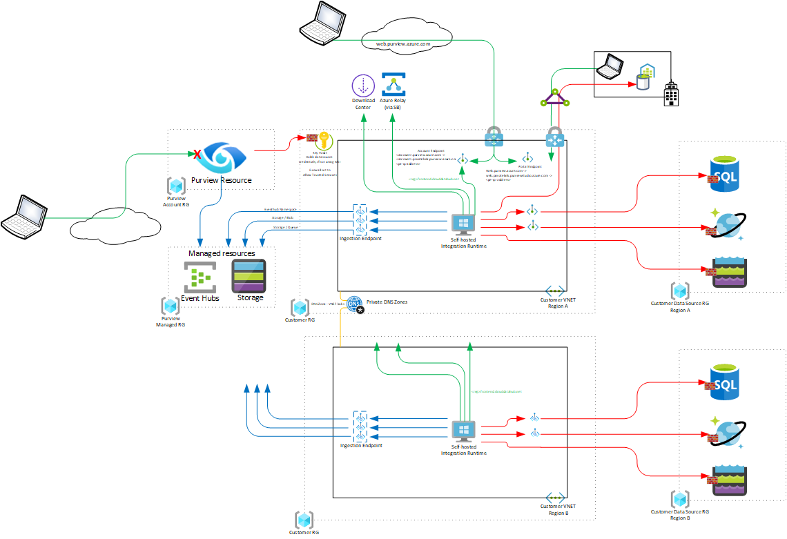

## Synapse Analytics
Azure Synapse Analytics combines SQL-based data warehousing (fka SQL Data Warehouse) with Apache Spark big data analytics, Kusto Data Explorer for log- and timeseries analytics. It also brings the Data movement ETL/ELT pipeline and SQL Server Integration Services (SSIS) capabilities of ADFv2. 

Synapse uses customer-dedicated compute to provide the Apache Spark, Data Explorer, Data movement and SSIS capabilities. As with ADFv2 and Purview, this compute can be deployed in a Public/shared network, or be injected in Managed or customer-owned VNETs.

SQL On-demand and Dedicated Pools are provided on the multi-tenant Azure SQL platform and cannot be VNET injected. Private network access to SQL Pools can be provided through Managed or customer Private Endpoints, from the Managed VNET or a customer-owned VNET.

### Synapse Public access
This is the default workspace network configuration, deployed by selecting Disable for Managed virtual network in the Networking tab when creating the workspace.
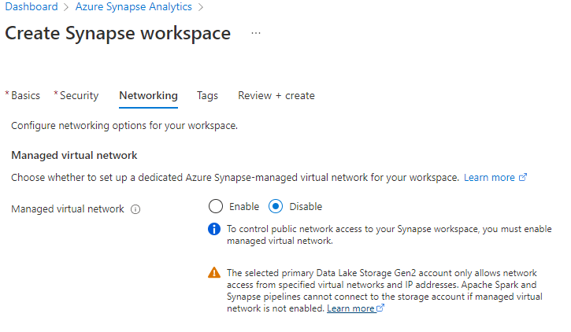

Apache Spark- and Data Explorer Pools and Azure Integration Runtimes are deployed in a shared VNET, connecting to Paas resources via public endpoints only.

:point_right:***Properties***
- The Studio web portal at https://web.azuresynapsenet/ and workspace endpoints are accessible over the public endpoint only. Public access can be limited via firewall rules.
- Apache Spark- and Data Explorer Pools, and Azure Integration Runtimes are deployed in a shared VNET and connect to Paas resources via public endpoints. 
- Outbound traffic from Integration Runtimes is sourced from a Public IP in the DataFactory.{region} ranges.
:exclamation:Connections to Storage accounts in the same region as the Integration Runtime originate from internal Azure data center addresses.
- Azure Paas service firewalls on data stores may be used to restrict network access, but the exception "Allow Azure services on the trusted services list to access this storage account."
must be enabled. This allows ADF to access the data stores, as described in [Trusted access based on a managed identity](https://docs.microsoft.com/en-us/azure/storage/common/storage-network-security?tabs=azure-portal#trusted-access-based-on-a-managed-identity).
- It is not possible to restrict access to Paas services to Synapse managed runtimes from a specific Synapse account. Use Managed VNET with Managed Private Endpoints or a Self-Hosted Integration Runtime if network-level access restriction to a specific runtime instance is required.

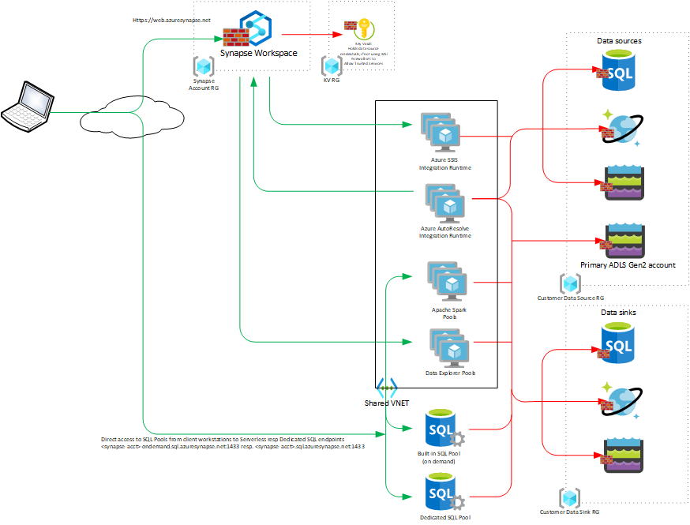

### Synapse Public access with Managed VNET 
The Managed VNET configuration is deployed by selecting Enable for Managed virtual network in the Networking tab when creating the workspace. This also enables Private Endpoint connectivity to the Studio and workspace endpoints.

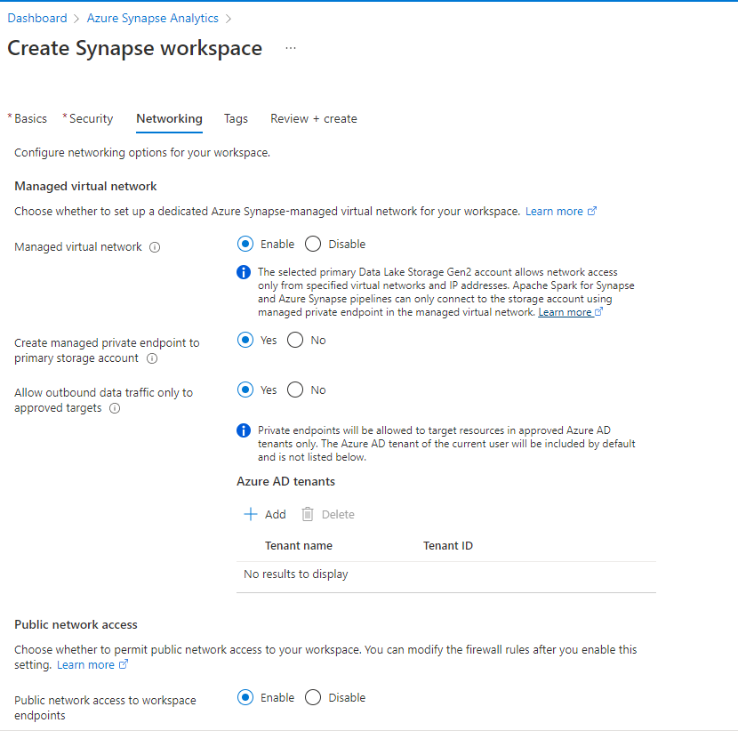

Apache Spark- and Data Explorer Pools and Azure Integration Runtimes are deployed in a Managed VNET, and connect to Paas resources either via public endpoints or via Managed Private Endpoints. Managed PE's to the default Data Lake, SQL Server and SQL Ondemand Pool, required for operation of the workspace, are pre-provisioned. Managed PE's to customer data stores are provisioned through the Studio portal.

:point_right:***Properties***
- The Studio web portal at https://web.azuresynapsenet/ and workspace endpoints are accessible over the public endpoint or a Private Endpoint. Public access can either be disabled completely, or be limited via firewall rules.
- Apache Spark- and Data Explorer Pools, and Azure Integration Runtimes are deployed in a Managed VNET and connect to Paas resources either via public endpoints or Managed Private Endpoints. 
- Outbound traffic from Integration Runtimes is sourced from a Public IP in the DataFactory.{region} ranges.
:exclamation:Connections to Storage accounts in the same region as the Integration Runtime originate from internal Azure data center addresses.
- Azure Paas service firewalls on data stores may be used to restrict network access, but the exception "Allow Azure services on the trusted services list to access this storage account."
must be enabled. This allows ADF to access the data stores, as described in [Trusted access based on a managed identity](https://docs.microsoft.com/en-us/azure/storage/common/storage-network-security?tabs=azure-portal#trusted-access-based-on-a-managed-identity).

Managed Private Endpoints are deployed into the Managed VNET from Studio

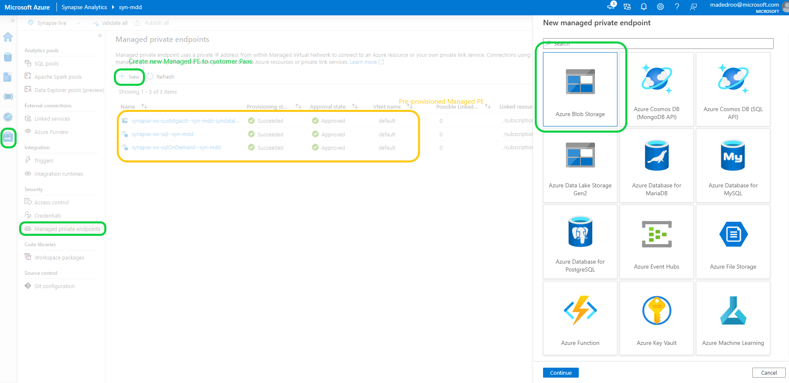

### Synapse Public access with Managed VNET and customer VNET
A customer VNET can contain Self Hosted- and SSIS Integration Runtimes, and Private Endpoints to the Synapse Workspace subresources. The /Dev subresource connects to the Workspace API, /Sql and /SqlOnDemand connect to the SQL Pools.

Workspace Public network access can now be set to Disabled on the Networking page of the Workspace in the Azure Portal.

:point_right: Synapse Studio is still accessed over a public endpoint, requiring outbound internet access from client workstations.

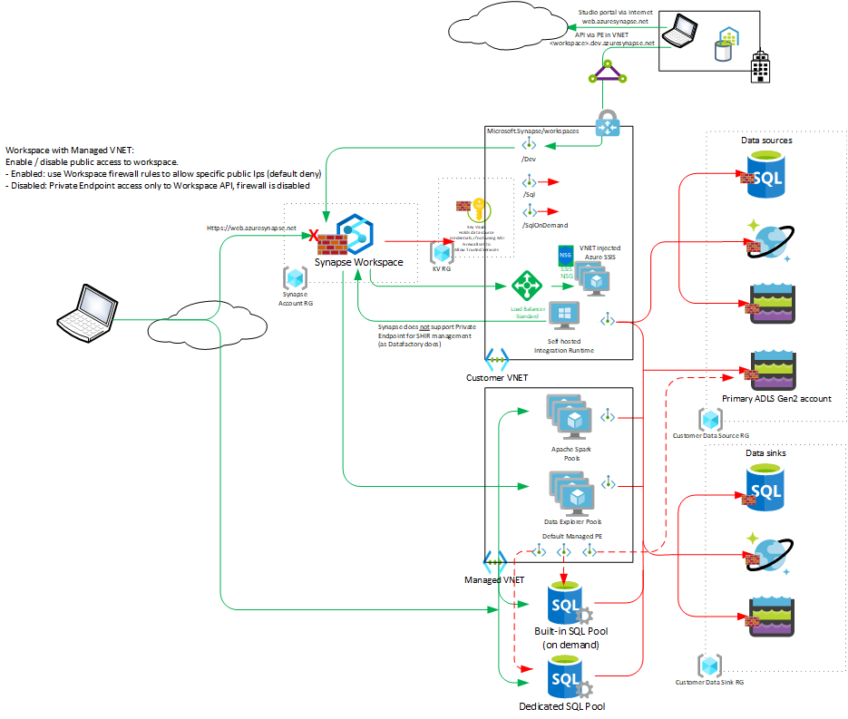

### Synapse Private access
Synapse Private Link Hub provides Private Endpoint connectivity to the Studio, so that no outbound internet is required from client workstations.

Synapse Private Link Hub is a top-level separate resource, created in the Azure portal.

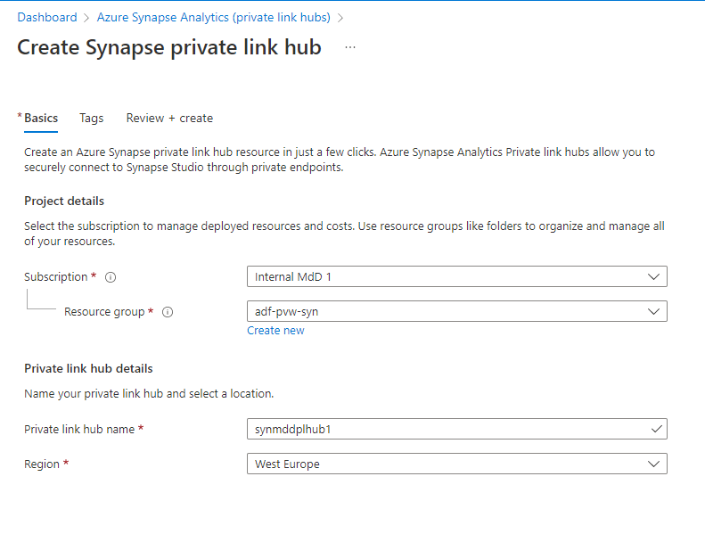

A Private Endpoint connecting to the Private Link Hub's Web sub-resource is then deployed in the customer's VNET. This provides private access to the Studio from the VNET, peered VNETs or on-premise.

 DNS resolution from web.privatelink.azuresynapse.net to the PE's private IP address is required. The portal experience creates a Private DNS zone, when deploying through code this must arranged separately.

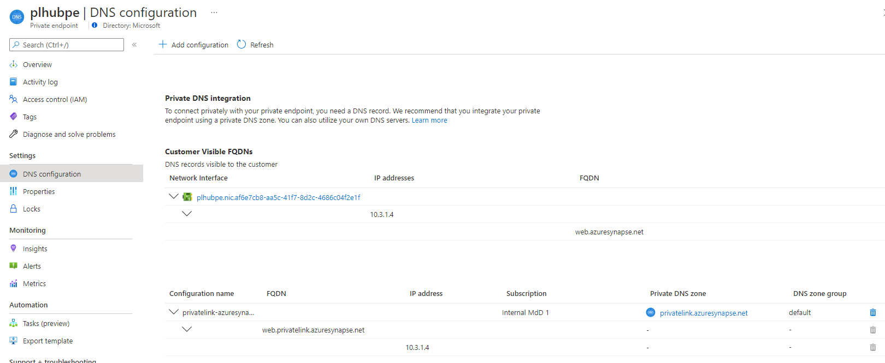

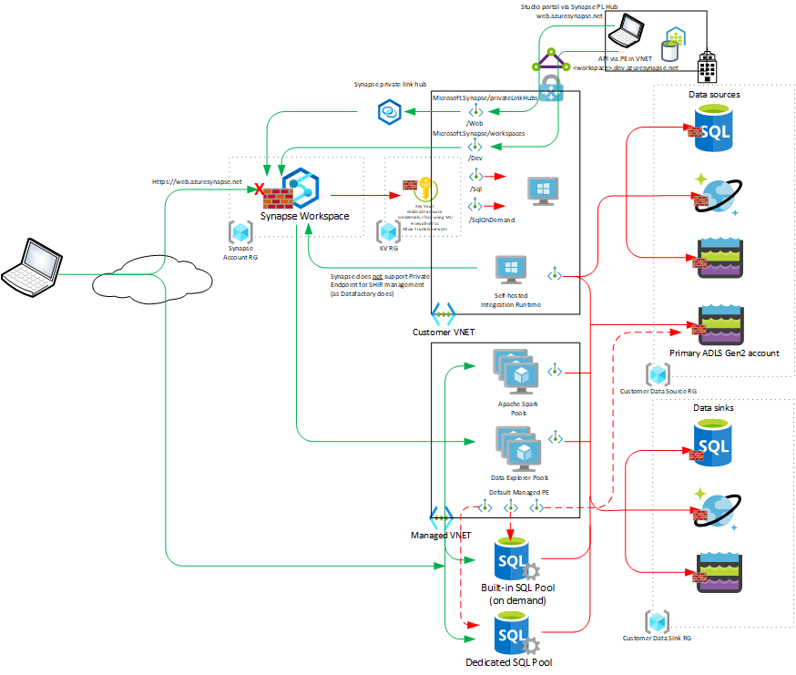
